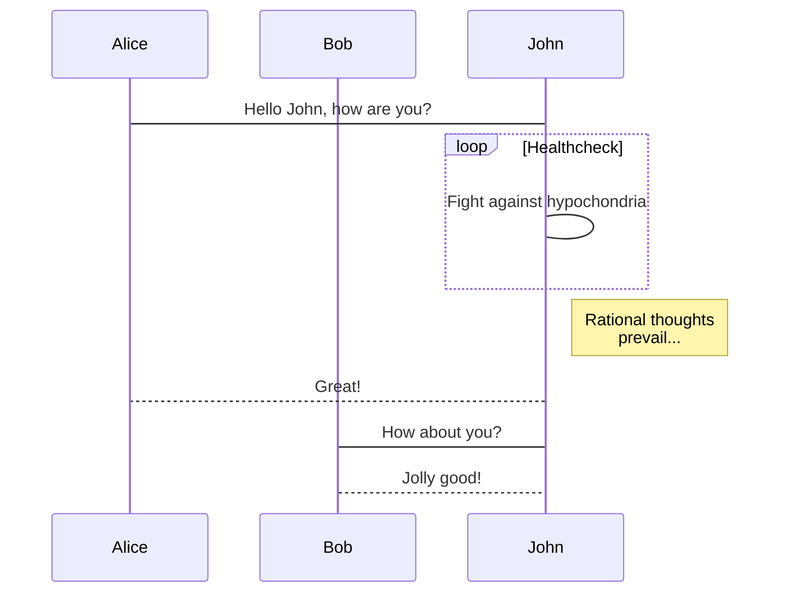
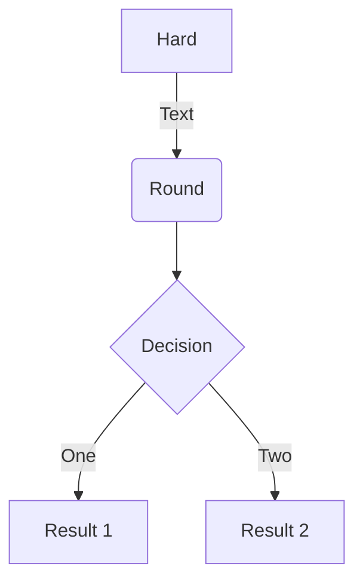
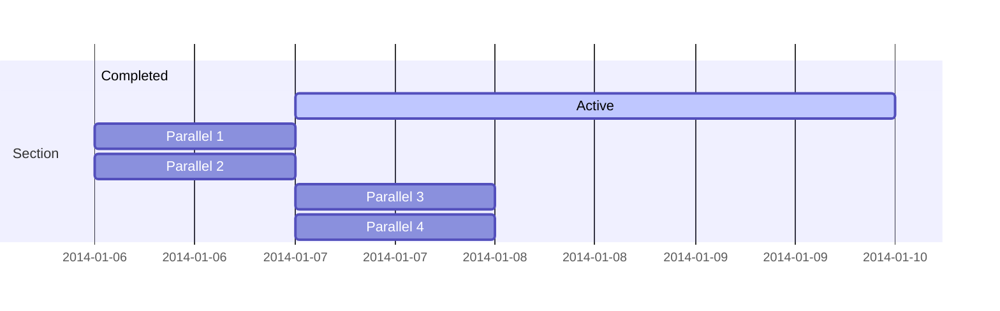
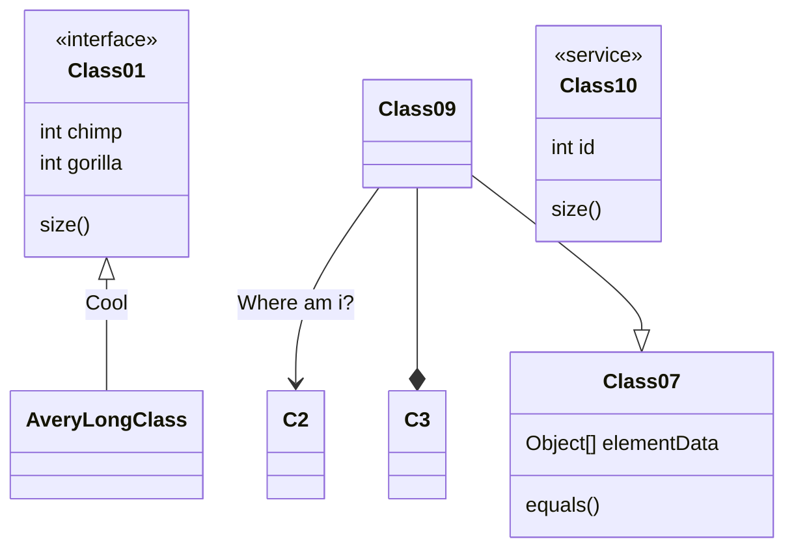
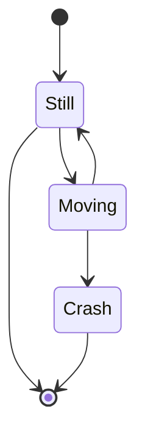
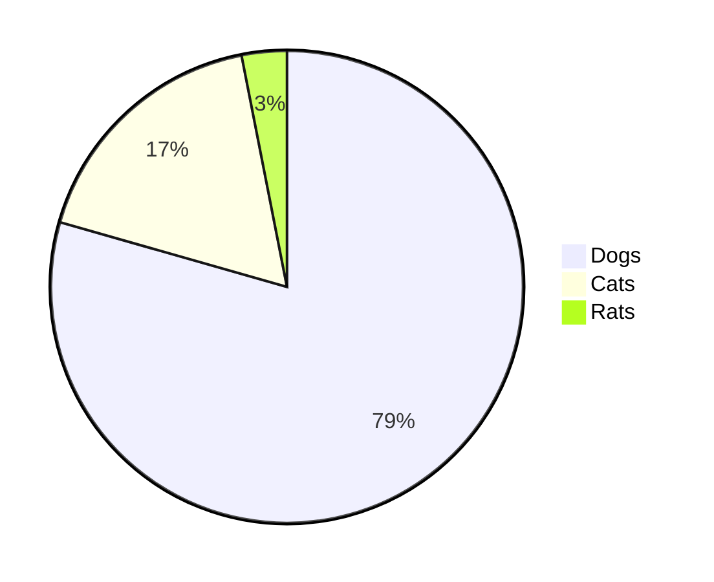

## MathJax

> A JavaScript display engine for mathematics that works in all browsers.No more setup for readers. It just works.

When \\(a \\ne 0\\), there are two solutions to \\(\(ax^2 + bx + c = 0\)\\) and they are \\[x = {-b \pm \sqrt{b^2-4ac} \over 2a}.\\]

## ChartJS

> Simple yet flexible JavaScript charting for designers & developers

```chart
{
    "type": "bar",
    "data": 
       {
        "labels": ["One", "Two", "Three", "Four", "Five", "Six"],
        "datasets": [{
            "label": "# of Votes",
            "data": [12, 19, 3, 5, 3, 8]
        }]
    }
}
```

```chart
    {
    "type": "line",
        "data": {
            "labels": ["One", "Two", "Three", "Four", "Five", "Six"],
            "datasets": [
            {
                "label": "# of Votes",
                "data": [12, 19, 3, 5, 2, 3],
                "backgroundColor":"transparent",
                "borderColor":"orange"
            },
            {
                "label": "Some other set",
                "data": [15, 8, 13, 5, 5, 9],
                "backgroundColor":"transparent",
                "borderColor":"#44ccff"
            }
            ]
        }
    }
```

## FLowChart

> flowchart.js is a flowchart DSL and SVG render that runs in the browser and terminal. Nodes and connections are defined in separately so that nodes can be reused and connections can be quickly changed.

```flowchart
st=>start: Start|past:>http://www.google.com[blank]
e=>end: End|future:>http://www.google.com
op1=>operation: My Operation|past
op2=>operation: Stuff|current
sub1=>subroutine: My Subroutine|invalid
cond=>condition: Yes
or No?|approved:>http://www.google.com
c2=>condition: Good idea|rejected
io=>inputoutput: catch something...|future

st->op1(right)->cond
cond(yes, right)->c2
cond(no)->sub1(left)->op1
c2(yes)->io->e
c2(no)->op2->e
```

## JS Sequence Diagram support

> Generates UML sequence diagrams from simple text

```msc
Alice->Bob: Hello Bob, how are you?
Note right of Bob: Bob thinks
Bob-->Alice: I am good thanks!
```

```msc
Title: Here is a title
A->B: Normal line
B-->C: Dashed line
C->>D: Open arrow
D-->>A: Dashed open arrow
```

## KaTex

> KaTeX is a fast, easy-to-use JavaScript library for TeX math rendering on the web.

The following

$$ \int_{a}^{b} x^2 dx $$

Is an integral

$$ \varphi = 1+\frac{1} {1+\frac{1} {1+\frac{1} {1+\cdots} } } $$

Enable Katex in the config file by setting the `katex` param to `true`. This will import the necessary Katex CSS/JS. 

See the online reference of [supported TeX functions](https://katex.org/docs/supported.html). 

**Note:** For inline math to render correctly, your content file extension must be `.mmark`. See the [official mmark site](https://mmark.nl/). 

```
Inline math: $ \varphi = \dfrac{1+\sqrt5}{2}= 1.6180339887… $
```

Inline math: $ \varphi = \dfrac{1+\sqrt5}{2}= 1.6180339887… $

```
Block math:

$$ \varphi = 1+\frac{1} {1+\frac{1} {1+\frac{1} {1+\cdots} } } $$
```

Block math:

$$ \varphi = 1+\frac{1} {1+\frac{1} {1+\frac{1} {1+\cdots} } } $$

## Mermaid

> Generate diagrams, charts, graphs or flows from markdown-like text via javascript.














## Wavedrom support

> WaveDrom is a Free and Open Source online digital timing diagram (waveform) rendering engine that uses javascript, HTML5 and SVG to convert a WaveJSON input text description into SVG vector graphics.

```wave
{ 
  "signal": [ {"name": "CLK", "wave": "p.....|..."},
            {"name":"DAT", "wave":"x.345x|=.x", "data":["A","B","C","D"]},
            {"name": "REQ", "wave": "0.1..0|1.0"},
            {},
            {"name": "ACK", "wave": "1.....|01."}
]}
```